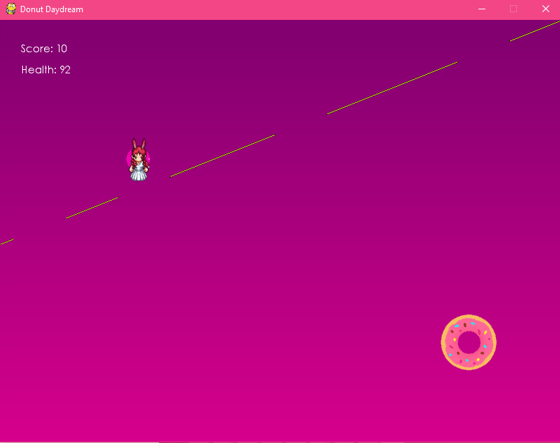
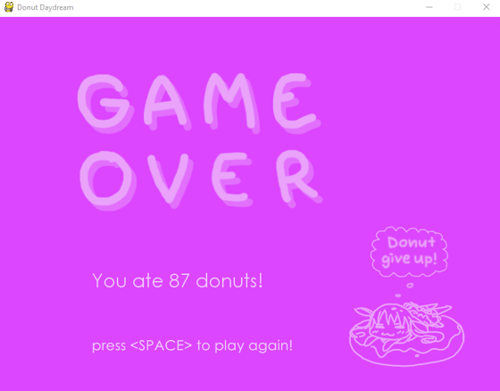

# donut-daydream
Authors: Dr. Robert Collier, Sarah Li

## Overview:
Usagi the bunny enters her donut dream world with the goal of satisfying her sweet tooth while trying to avoid the obstacles she faces along the way.
The player must control Usagi using the arrow keys and eat as many donuts as they can while trying to avoid the rainbow beam, which will decrease her health points in the dream and makes her wake up. The game will end when her health drops to 0.

## Source Files:
- `donut_daydream.py`, the game

## Launching Instructions:
Note: Before running the game, make sure Python and Pygame are installed on your computer.
1. Open the command line and change the directory to where the files are located
2. Type `python donut_daydream.py` and hit the Enter key to run the program

## Operating Instructions:
1. Press "Space" to play
2. Press the arrow keys to control Usagi
3. Eat the donuts and avoid the rainbow beam
4. On the "Game Over" screen, press "Space" to play again

## Screenshots:

