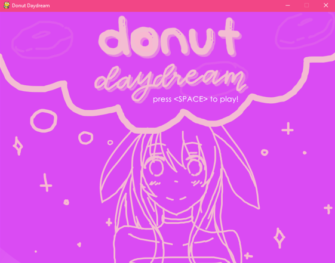

# donut-daydream
Authors: Dr. Robert Collier, Sarah Li

Usagi the bunny enters her donut dream world with the goal of satisfying her sweet tooth while trying to avoid the obstacles she faces along the way.

Overview:
The player must control Usagi using the arrow keys and eat as many donuts as they can while trying to avoid the rainbow beam, which will decrease her health points in the dream and makes her wake up. The game will end when her health drops to 0.

Screenshots:

